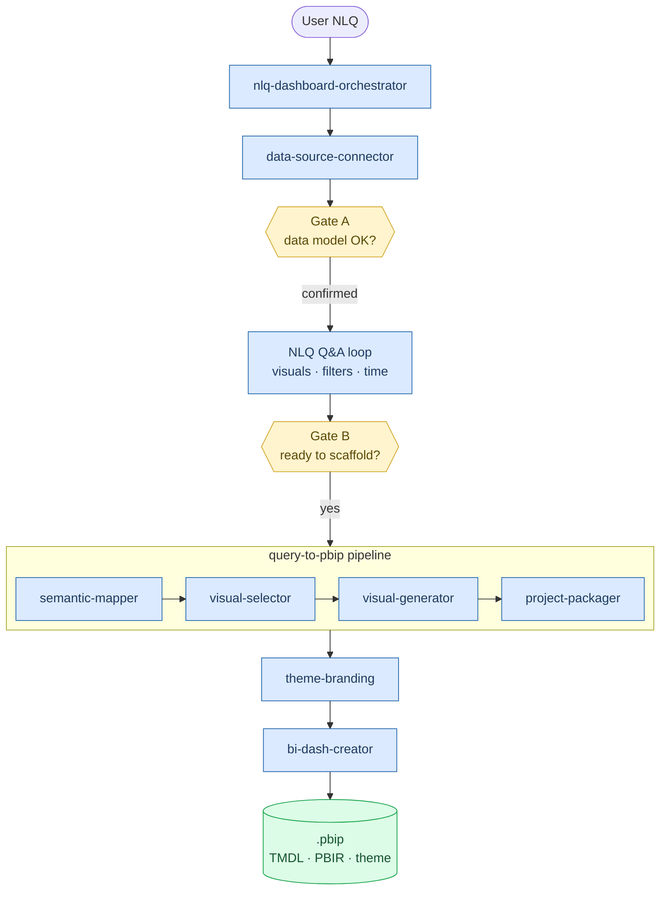

<div align="center">

# Power BI Dashboard Generator

**A modular Agent Skills toolkit that turns plain-English requests into fully-formed, branded Power BI Desktop Projects (PBIP).**

[](https://www.python.org/downloads/)
[](https://learn.microsoft.com/power-bi/developer/projects/projects-overview)
[](https://learn.microsoft.com/analysis-services/tmdl/tmdl-overview)
[](https://docs.claude.com/en/docs/claude-code/plugins)
[](LICENSE)
[](#-overview)

[Overview](#overview) ·
[Quick Start](#-quick-start) ·
[Architecture](#-architecture) ·
[Skills](#-skill-inventory) ·
[Examples](#-example-walkthrough) ·
[Learning Path](#-learning-path)

</div>

---

## Overview

**Power BI Dashboard Generator** is an open, educational reference implementation of an **agent-driven BI authoring pipeline**. It demonstrates how a Large Language Model (LLM) agent - equipped with a set of well-scoped, file-based *skills* - can take a natural-language request such as *"Build me a sales performance dashboard from `sales.xlsx`"* and emit a complete, openable Power BI Desktop Project (PBIP) without manual modeling, DAX, or visual configuration.

The project is intentionally structured for **learning**:

- Every skill is a self-contained folder under `skills/` with a Markdown `SKILL.md` contract, reference docs, and runnable Python scripts.
- The pipeline is split into **single-responsibility stages** so each step can be studied, tested, and replaced in isolation.
- All artifacts the agent produces (`data-model.json`, TMDL files, PBIR `visual.json`) are plain text and human-readable.

> **Use this repo to learn:** prompt-engineering for code-generation agents, the PBIP/TMDL/PBIR file formats, source-agnostic semantic modeling, SQL → DAX translation, and visual-bucket selection heuristics.

---

## 🚀 Quick Start

### Install

```bash
git clone https://github.com/bcastelino/powerbi-dashboard-generator.git
cd powerbi-dashboard-generator
pip install -r requirements.txt
```

### Register the skills

Drop or symlink the `skills/` folder into your agent runtime. The agent will discover each `SKILL.md` automatically - no further configuration required. See the [Installation Guide](#-installing-the-skills) below for runtime-specific instructions.

### Ask for a dashboard

```text
User > Build me a sales performance dashboard from sales.xlsx

Agent > [invokes nlq-dashboard-orchestrator]
        [invokes data-source-connector → introspects sales.xlsx]
        [Gate A] Confirms data model with user
        [NLQ loop] Clarifies visuals, filters, layout
        [Gate B] "Ready to scaffold? (yes/no)"
        [pipeline] Generates PBIP → applies theme → assembles dashboard
        ✓ Dashboard ready: generated-dashboards/SalesPerformanceDash/
```

Open the resulting `.pbip` file in Power BI Desktop - the semantic model loads, the report renders, and visuals connect to live data.

---

## 🏗 Architecture

The system is a **staged pipeline** orchestrated by a top-level NLQ skill, with two human-in-the-loop confirmation gates and file-based handoffs between every skill.



### The two confirmation gates

The orchestrator never generates files silently. It pauses at two explicit checkpoints:

| Gate | Question | Purpose |
|---|---|---|
| **Gate A** | *"Is the discovered data model correct?"* | Confirms tables, columns, types, and relationships before any modeling work begins. Ambiguities trigger targeted clarifying questions. |
| **Gate B** | *"Are you done with clarifications and ready to scaffold all visuals into the final dashboard?"* | Summarizes every planned visual after the NLQ Q&A loop. The pipeline only runs on explicit user confirmation. |

This design makes the agent **auditable**: a user can always inspect what the agent *thinks* before it writes a single file.

---

## 🧩 Skill Inventory

Each skill is a folder under `skills/` containing a `SKILL.md` contract, optional `references/`, `scripts/`, and `assets/`.

| Skill | Role | Stage |
|---|---|---|
| `nlq-dashboard-orchestrator` | Top-level NLQ entry point with user-confirmation gates | Entry |
| `data-source-connector` | Source-agnostic schema introspection → `data-model.json` | Pre-pipeline |
| `query-to-pbip` | Orchestrates the four-stage PBIP build pipeline | Pipeline |
| `semantic-mapper` | Stage 1 - TMDL semantic model from data model | Pipeline |
| `visual-selector` | Stage 2 - Choose visual type from data profile | Pipeline |
| `visual-generator` | Stage 3 - Emit PBIR `visual.json` files | Pipeline |
| `project-packager` | Stage 4 - Scaffold + validate + zip the PBIP | Pipeline |
| `theme-branding` | Apply professional themes / corporate branding | Post-pipeline |
| `bi-dash-creator` | Compose multi-visual dashboards from generated reports | Post-pipeline |

---

## 💻 Installing the Skills

The skills are plain folders containing a `SKILL.md` contract plus optional `references/`, `scripts/`, and `assets/`. Any agent runtime that can read Markdown skill manifests can use them. Below are step-by-step instructions for the most common targets.

### Option A - One-liner installers ⭐ recommended

Pick the one that matches your shell. Each command clones the repo, links every skill into your agent's skills directory, and installs the Python dependencies.

**macOS / Linux / WSL (`curl | bash`)**

```bash
curl -fsSL https://raw.githubusercontent.com/bcastelino/powerbi-dashboard-generator/main/install.sh | bash
```

Pass a custom target as the first argument (defaults to `~/.claude/skills`):

```bash
curl -fsSL https://raw.githubusercontent.com/bcastelino/powerbi-dashboard-generator/main/install.sh | bash -s -- ~/.windsurf/skills
```

**Windows (PowerShell)**

```powershell
irm https://raw.githubusercontent.com/bcastelino/powerbi-dashboard-generator/main/install.ps1 | iex
```

For symlinks to succeed on Windows, run PowerShell as **Administrator** or enable **Developer Mode** (Settings → Update & Security → For developers). The script falls back to a full copy if symlinks aren't available.

**Cross-platform via `npx` (community CLI)**

If you have Node.js installed, the [`skills`](https://github.com/microsoft/skills) CLI works against any GitHub repo whose `skills/` folder follows the SKILL.md convention:

```bash
npx skills add bcastelino/powerbi-dashboard-generator
```

It opens an interactive picker, lets you select which skills to install, detects your agent (Claude Code, Copilot, Windsurf, etc.), and symlinks them into the correct directory.

### Option B - Claude Code plugin marketplace (native)

If you're already inside a Claude Code session, this is the most idiomatic path - no shell required:

```text
/plugin marketplace add bcastelino/powerbi-dashboard-generator
/plugin install powerbi@powerbi-dashboard-generator
```

Claude Code will pull the marketplace manifest from `.claude-plugin/marketplace.json`, install all ten skills, and make them available in every future session.

```text
To update:
/plugin marketplace update powerbi-dashboard-generator

To uninstall:
/plugin uninstall powerbi@powerbi-dashboard-generator
```

You'll still need to install the Python dependencies once:

```bash
pip install pandas pyyaml openpyxl sqlalchemy
```

### Verifying the installation

Ask the agent:

```text
List the skills you have available, then describe what `query-to-pbip` does.
```

You should see all ten skills enumerated. If you only see some, check that `SKILL.md` exists in each folder and that the runtime has read permissions.

### Troubleshooting

| Symptom | Likely cause | Fix |
|---|---|---|
| Agent doesn't see the skills | Skills directory not registered | Confirm the runtime's skills-folder path; restart the runtime |
| `ModuleNotFoundError` from a skill script | Python deps not installed | Run `pip install -r requirements.txt` in the same env the agent uses |
| Symlinks fail on Windows | Non-admin shell | Re-run PowerShell as Administrator, or enable Developer Mode |
| Skill is found but never triggers | `description:` doesn't match user intent | Edit the `description:` field in `SKILL.md` to include relevant keywords |
| PBIP won't open in Power BI Desktop | PBIP preview disabled | Power BI Desktop → File → Options → Preview features → enable *Power BI Project (.pbip) save option* |

---

## �🔌 Supported Data Sources

`data-source-connector` is intentionally source-agnostic. Out-of-the-box recipes exist for:

| Category | Sources |
|---|---|
| **SQL databases** | SQL Server, PostgreSQL, MySQL, Oracle |
| **Cloud warehouses** | Databricks, Snowflake, BigQuery, Azure Synapse |
| **Files** | Excel (`.xlsx`), CSV, Parquet |
| **APIs / lists** | OData, REST, SharePoint Lists |

See `skills/data-source-connector/references/connection-patterns.md` for connection recipes and authentication patterns.

---

## 📦 Output

Each run produces a `.pbip` project compatible with Power BI Desktop (June 2023+ with the PBIP preview enabled):

```text
generated-dashboards/<Name>Dash/
├── <Name>Dash.pbip
├── <Name>Dash.SemanticModel/     # TMDL - tables, measures, relationships
│   ├── database.tmdl
│   ├── model.tmdl
│   ├── relationships.tmdl
│   └── tables/
│       └── <TableName>.tmdl
└── <Name>Dash.Report/            # PBIR - pages, visuals, theme
    ├── report.json
    ├── pages/
    └── StaticResources/
        └── SharedResources/
            └── BaseThemes/
```

Open the `.pbip` file in Power BI Desktop: the semantic model loads, the report renders, and visuals connect to live data - no further configuration needed.

---

## 🧪 Example Walkthrough

A minimal end-to-end run, annotated for learners:

```text
1. User: "Show me monthly revenue by region for the last 12 months."

2. nlq-dashboard-orchestrator parses intent and invokes data-source-connector,
   which introspects the source and emits data-model.json.

3. Gate A: agent shows the discovered schema. User confirms.

4. NLQ loop clarifies:
     - "Region" → customer_state (Nominal, geographic)
     - "Monthly" → dim_date.month (Temporal)
     - "Revenue" → SUM(fact_sales.total_value)
     - Time window → data-anchored last 12 months

5. Gate B: agent lists the planned visuals (lineChart, slicer, card).
   User says "yes".

6. Pipeline runs:
     - semantic-mapper      → emits TMDL with [Total Revenue] DAX measure
     - visual-selector      → chooses lineChart with month Category & state Series
     - visual-generator     → writes visual.json files
     - project-packager     → zips into RevenueByRegionDash.pbip
     - theme-branding       → applies the "Corporate" preset

7. Output: generated-dashboards/RevenueByRegionDash/RevenueByRegionDash.pbip
```

---

## 🎓 Learning Path

If you are using this repo to **learn agent-driven BI authoring**, we recommend reading the skills in this order:

1. **`skills/nlq-dashboard-orchestrator/SKILL.md`** - how a top-level skill structures a multi-turn conversation with confirmation gates.
2. **`skills/data-source-connector/SKILL.md`** + `references/connection-patterns.md` - how to normalize heterogeneous sources into one schema.
3. **`skills/semantic-mapper/SKILL.md`** + `references/sql-to-dax-reference.md` - how SQL aggregations and joins translate to DAX measures and TMDL relationships.
4. **`skills/visual-selector/SKILL.md`** + `references/*.md` - heuristics for picking the right chart from a data profile.
5. **`skills/visual-generator/SKILL.md`** - the PBIR `visual.json` shape and bucket-binding mechanics.
6. **`skills/project-packager/SKILL.md`** - assembly, validation, and the PBIP folder layout.
7. **`skills/theme-branding/SKILL.md`** + `references/theme-schema.md` - Microsoft's official report-theme JSON schema, structural colors, text classes, and `ThemeDataColor` binding.

Each `SKILL.md` is designed to be readable as a **standalone tutorial**.

---

## 📁 Repository Layout

```text
powerbi-dashboard-generator/
├── README.md                  # this file
├── LICENSE                    # MIT License
├── requirements.txt           # Python dependencies
├── install.sh                 # one-liner installer (macOS / Linux / WSL)
├── install.ps1                # one-liner installer (Windows PowerShell)
├── .gitignore
├── .claude-plugin/            # Claude Code plugin marketplace manifest
│   ├── marketplace.json       # makes this repo installable via /plugin marketplace add
│   └── plugin.json            # plugin metadata (name, version, author, keywords)
└── skills/                    # all agent skills, one folder each
    ├── nlq-dashboard-orchestrator/
    ├── data-source-connector/
    ├── query-to-pbip/
    ├── semantic-mapper/
    ├── visual-selector/
    ├── visual-generator/
    ├── project-packager/
    ├── theme-branding/
    └── bi-dash-creator/
```

---

## 🛠 Tech Stack

- **Python 3.10+** - for the data-introspection scripts (`pandas`, `sqlalchemy`, `openpyxl`, `pyyaml`)
- **TMDL** - Tabular Model Definition Language for the semantic model
- **PBIR** - Power BI Report JSON format for visuals and pages
- **Microsoft Power BI report-theme schema** - for theming (`reportThemeSchema-2.140.json`)
- **Markdown-based skill contracts** - every skill exposes its capabilities via `SKILL.md`
- **Claude Code plugin format** - `.claude-plugin/marketplace.json` makes this repo installable as a one-liner

---

## 🤝 Contributing

Contributions are welcome - this project is explicitly designed to grow.

- **Add a new data source?** Drop a new recipe into `skills/data-source-connector/references/connection-patterns.md` and extend the introspection script.
- **Add a new visual type?** Add a template under `skills/visual-selector/references/` and wire it into the decision matrix in `SKILL.md`.
- **Add a new theme?** Add a JSON file under `skills/theme-branding/assets/themes/` following the Microsoft schema.

Open an issue or pull request describing the change before submitting large additions.

---

## 📚 References

- [Power BI Desktop Projects (PBIP) - Microsoft Learn](https://learn.microsoft.com/power-bi/developer/projects/projects-overview)
- [TMDL Overview - Microsoft Learn](https://learn.microsoft.com/analysis-services/tmdl/tmdl-overview)
- [Use report themes in Power BI Desktop](https://learn.microsoft.com/power-bi/create-reports/desktop-report-themes)
- [Create custom report themes](https://learn.microsoft.com/power-bi/create-reports/report-themes-create-custom)
- [DAX function reference](https://learn.microsoft.com/dax/dax-function-reference)

---

## 📄 License

Released under the [MIT License](LICENSE) - free to use, modify, and redistribute for both personal and commercial purposes. Attribution is appreciated but not required.

---

<div align="center">

*Built to demonstrate that agent-driven BI authoring can be transparent, auditable, and source-agnostic.*

</div>
